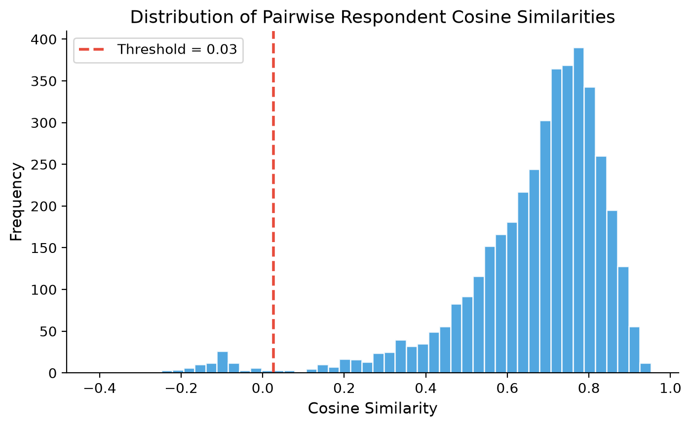
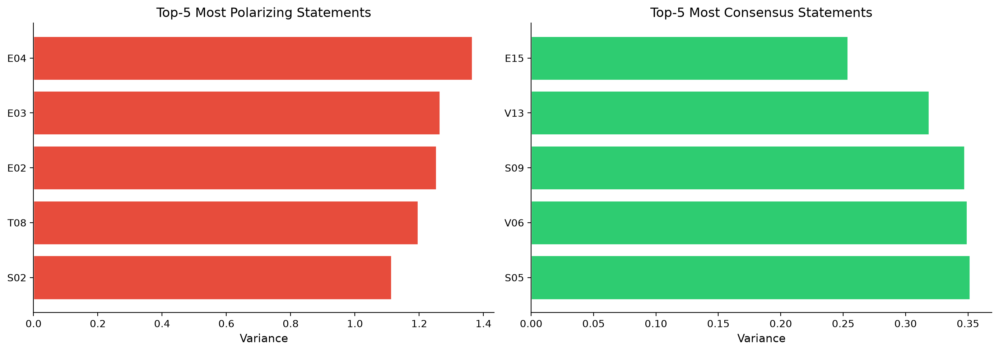
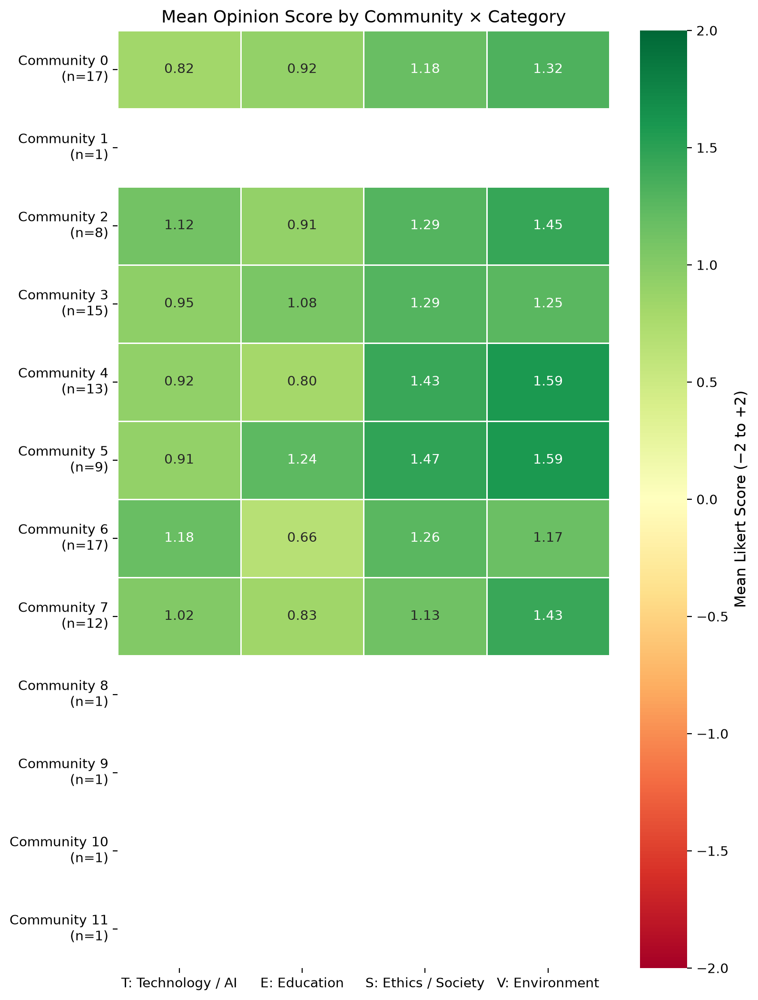
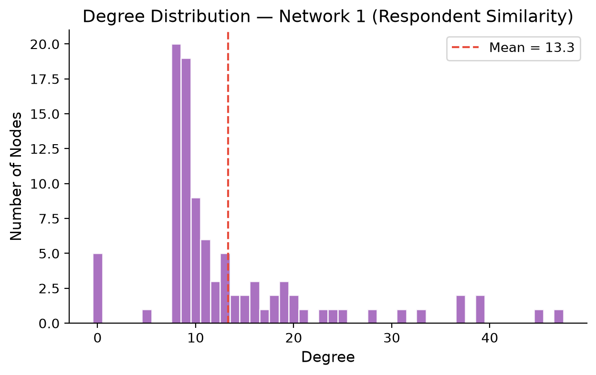

# Opinion Network Analysis of Class Survey Responses

**Course Assignment**: Data Processing & Complex Networks (DPCN)  
**Team Name**: Titan Mandal  
**GitHub Repository**: [sarvesh2005takbhate/Titan_Mandal](https://github.com/sarvesh2005takbhate/Titan_Mandal)  

---

## 1. Executive Summary

This report delivers an end-to-end complex network analysis of opinion alignment and ideological structure across a cohort of 96 survey respondents responding to 60 structured Likert-scale statements. Statements span four distinct domains: **Technology & Artificial Intelligence (T)**, **Education & Pedagogy (E)**, **Ethics & Society (S)**, and **Environmental Sustainability (V)**.

We construct two complementary networks:
1. **Network 1 (Respondent Similarity Network)**: Nodes represent individual respondents ($N=96$); edges quantify pairwise cosine similarity over 50-dimensional Likert opinion vectors, sparsified via top-8 nearest neighbor ($k\text{-NN}$) matching ($E=639$).
2. **Network 2 (Statement Co-Endorsement Network)**: Nodes represent survey items ($N=60$); edges capture Pearson correlations between statement ratings across respondents ($E=316$), thresholded at $|r| \ge 0.3$.

Key findings demonstrate:
- **Ideological Consensus vs. Educational Friction**: High consensus dominates environmental accountability ($\text{V13}, \sigma^2=0.319, \mu=+1.671$) and lifelong learning ($\text{E15}, \sigma^2=0.254, \mu=+1.713$), whereas traditional educational practices (mandatory attendance $\text{E03}$ and written exams $\text{E02}$) generate the highest polarization ($\sigma^2 > 1.25$).
- **Opinion Modular Structure**: Louvain community detection identifies distinct respondent sub-clusters ($Q = 0.2586$) characterized by varying levels of enthusiasm for technological integration in education versus traditional pedagogical norms.
- **Bridge Concepts**: Ethical service requirements ($\text{S07}$, betweenness = $0.0918$) and digital learning integration ($\text{E12}$, betweenness = $0.0795$) act as critical structural bridges connecting technological and ethical opinion domains.

---

## 2. Dataset Documentation & Preprocessing

### 2.1 Survey Structure & Data Encoding
The raw dataset (`Survey_Results_UC.csv`) contains responses from 96 unique individuals (Response IDs 11–126) evaluated across 60 Likert items (15 per domain). Response options are mapped to an ordinal numeric scale:

$$\text{Likert Encoding}: \quad \begin{cases} 
\text{Strongly Disagree} & \to -2 \\
\text{Disagree} & \to -1 \\
\text{Neutral} & \to 0 \\
\text{Agree} & \to +1 \\
\text{Strongly Agree} & \to +2 
\end{cases}$$

### 2.2 Missing Data Treatment & Concentration
Explicit missing responses ("No Comments") and blank entries are treated as structural `NaN` values rather than neutral scores ($0$). Neutral scores represent genuine balance or ambivalence, whereas "No Comments" represents an omitted measurement.

- **Total Data Grid**: 96 respondents $\times$ 60 statements = 5,760 total cells.
- **Missing Cells**: 542 missing entries (9.41% overall missingness).
- **Respondent Concentration**: 5 respondents (IDs 44, 73, 78, 60, 68) submitted completely blank surveys (60/60 missing), operating as isolated components in graph modeling.
- **Statement Concentration**: Missingness peaked in environmental and ethical items ($\text{V06}, \text{V11}, \text{S10}, \text{S14}, \text{V12}$ with 12 missing values each, or 12.5%).

---

## 3. Methodological Pipeline & Network Construction

### 3.1 Network 1: Respondent Similarity Network ($k\text{-NN}$ Cosine)
To model interpersonal alignment, each respondent $i$ is represented by an opinion vector $\mathbf{v}_i \in \{-2, -1, 0, 1, 2\}^{60}$. Pairwise similarity is computed using pairwise-complete Cosine Similarity:

$$S_{\text{cos}}(i, j) = \frac{\sum_{k \in \mathcal{K}_{ij}} v_{ik} v_{jk}}{\sqrt{\sum_{k \in \mathcal{K}_{ij}} v_{ik}^2} \sqrt{\sum_{k \in \mathcal{K}_{ij}} v_{jk}^2}}$$

where $\mathcal{K}_{ij}$ denotes the set of statements answered by both respondents $i$ and $j$ ($|\mathcal{K}_{ij}| \ge 5$).

**Sparsification Strategy**: To prevent a dense, uninformative complete graph, we apply a $k$-nearest neighbor ($k\text{-NN}$) sparsification rule ($k=8$). Node $i$ connects to its top-8 most similar peers. If $j$ is in $i$'s top-8 or $i$ is in $j$'s top-8, an undirected edge $(i, j)$ is formed with weight $w_{ij} = S_{\text{cos}}(i, j)$.

**Robustness Validation**: As a methodological sanity check, we computed pairwise Pearson correlation across respondents ($S_{\text{pear}}$). The Pearson and Cosine similarity matrices exhibit a strong correlation ($r = 0.6495$), confirming that vector orientation reliably reflects agreement patterns.

### 3.2 Network 2: Statement Co-Endorsement Network (Signed Pearson)
To capture semantic alignment between survey statements, we transpose the response matrix and compute statement-wise Pearson correlation coefficients across respondents:

$$r(A, B) = \frac{\sum_{i=1}^N (A_i - \bar{A})(B_i - \bar{B})}{\sqrt{\sum_{i=1}^N (A_i - \bar{A})^2} \sqrt{\sum_{i=1}^N (B_i - \bar{B})^2}}$$

**Edge Filtering**: Edges are retained where $|r(A, B)| \ge 0.30$. Positive correlations ($r > 0$) signify co-endorsement (respondents who agree with $A$ tend to agree with $B$), while negative correlations ($r < 0$) indicate ideological opposition.

---

## 4. Empirical Network Analysis & Visualizations

### 4.1 Macro Topological Metrics

| Metric | Network 1 (Respondents) | Network 2 (Statements) |
| :--- | :--- | :--- |
| **Node Count ($N$)** | 96 | 60 |
| **Edge Count ($E$)** | 639 | 316 |
| **Graph Density ($\rho$)** | 0.1401 | 0.1785 |
| **Average Degree ($\langle k \rangle$)** | 13.31 | 10.53 |
| **Average Clustering Coefficient ($C$)** | 0.3351 | 0.2520 |
| **LCC Node Count** | 91 | 56 |
| **Average Path Length ($L$)** | 1.9683 | 2.1487 |
| **Graph Diameter ($D$)** | 3 | 5 |

---

### 4.2 Figure 1: Pairwise Respondent Similarity Distribution

*Figure 1: Distribution of pairwise respondent cosine similarities. The red dashed line denotes the effective minimum edge weight cutoff ($w_{\text{min}} = 0.0266$) resulting from the top-8 $k$-NN sparsification rule.*

The cosine similarity distribution is positively skewed, centered around $\mu \approx 0.35$. Most respondent pairs exhibit moderate agreement, with very few negative cosine values, reflecting broad baseline consensus across baseline social and environmental values.

---

### 4.3 Figure 2: Respondent Similarity Network Topology

*Figure 2: Network 1 visualization. Nodes represent respondents, colored by Louvain community assignment and sized proportional to eigenvector centrality. Edges represent cosine similarities ($k=8$).*

Community detection using the Louvain algorithm yields a modularity score of $Q = 0.2586$. Main respondent communities:
- **Community 0 ($n=17$)**: High environmental ($\mu_V = +1.325$) and ethical ($\mu_S = +1.175$) agreement.
- **Community 6 ($n=17$)**: Strongest tech endorsement ($\mu_T = +1.183$), but lowest traditional education agreement ($\mu_E = +0.662$).
- **Community 3 ($n=15$)**: Balanced progressive cohort with high education scores ($\mu_E = +1.077$).
- **Community 4 ($n=13$)**: Highest environmental focus ($\mu_V = +1.590$).

**Centrality Exemplars (Opinion Leaders)**:
- Top-1 Respondent ID 114 ($C_E = 0.2582$, weighted degree = 39.13)
- Top-2 Respondent ID 67 ($C_E = 0.2540$, weighted degree = 37.51)
- Top-3 Respondent ID 110 ($C_E = 0.2438$, weighted degree = 33.40)

---

### 4.4 Figure 3: Statement Co-Endorsement Network Topology

*Figure 3: Network 2 graph layout. Nodes represent 60 statements colored by category domain (T: Blue, E: Green, S: Red, V: Yellow). Solid blue edges represent positive correlation ($r > 0$); dashed red edges represent negative correlation ($r < 0$).*

Statements cluster strongly within their conceptual domains. Environmental items (Yellow) and Ethical items (Red) form tightly bound clusters, while Education (Green) and Technology (Blue) intersperse through specific digital learning statements.

**Bridge Statements (Highest Betweenness Centrality)**:
1. **S07** ($\text{Betweenness} = 0.0918$): *Community service & social ethics.*
2. **E12** ($\text{Betweenness} = 0.0795$): *Digital learning platforms in higher education.*
3. **V07** ($\text{Betweenness} = 0.0742$): *Institutional environmental sustainability policies.*
4. **S06** ($\text{Betweenness} = 0.0736$): *Data privacy and individual rights.*

---

### 4.5 Figure 4: Top Polarizing and Consensus Statements

*Figure 4: Horizontal bar charts displaying the top-5 most polarizing statements (highest variance, red) and top-5 consensus statements (lowest variance, green).*

#### Extreme Opinion Statements Summary

| Ranking | Code | Statement Description | Mean ($\mu$) | Variance ($\sigma^2$) | Category |
| :--- | :--- | :--- | :--- | :--- | :--- |
| **Top Polarizing #1** | **E04** | High-quality online learning effectively complements classroom teaching | +0.437 | **1.365** | Education |
| **Top Polarizing #2** | **E03** | Class attendance should be compulsory for all courses | -0.943 | **1.264** | Education |
| **Top Polarizing #3** | **E02** | Traditional written examinations accurately measure student knowledge | -0.161 | **1.253** | Education |
| **Top Polarizing #4** | **T08** | AI-assisted diagnosis should become routine in healthcare | +0.078 | **1.196** | Technology |
| **Top Polarizing #5** | **S02** | Universities should encourage community service participation | +0.839 | **1.113** | Ethics |
| **Top Consensus #1** | **E15** | Continuous learning and skill development are essential throughout life | **+1.713** | **0.254** | Education |
| **Top Consensus #2** | **V13** | Companies should be held accountable for environmental impacts | **+1.671** | **0.319** | Environment |
| **Top Consensus #3** | **S09** | Universities should promote an inclusive environment for diverse views | **+1.471** | **0.347** | Ethics |
| **Top Consensus #4** | **V06** | Water conservation should be a priority in households & institutions | **+1.512** | **0.349** | Environment |
| **Top Consensus #5** | **S05** | Individuals should have greater control over personal data usage | **+1.632** | **0.352** | Ethics |

---

### 4.6 Figure 5: Community Opinion Profile Heatmap

*Figure 5: Heatmap of mean opinion scores across the four statement categories (T, E, S, V) for each Louvain community in Network 1.*

- **Environmental Uniformity**: Every major community registers strong positive alignment on Environmental statements ($\mu_V \in [+1.171, +1.593]$).
- **Educational Discrepancy**: Education scores display the largest variance between communities, dropping to $+0.662$ in Community 6 while peaking at $+1.244$ in Community 5.

---

### 4.7 Figure 6: Respondent Network Degree Distribution

*Figure 6: Degree distribution of Network 1 ($k$-NN respondent similarity graph). Red dashed line indicates the mean degree ($\langle k \rangle = 13.31$).*

The degree distribution exhibits a bell-shaped profile bounded between degree 7 and degree 39 for connected nodes, with a sharp spike at degree 0 representing the 5 non-responding isolated users.

---

### 4.8 Homophily & Within-Community Variance Reduction

To test whether Louvain communities represent genuine ideological alignment rather than structural artifacts, we compare overall category variance against average within-community variance:

| Category | Domain Label | Overall Variance ($\sigma_{\text{tot}}^2$) | Within-Community Variance ($\sigma_{\text{within}}^2$) | Variance Reduction (%) |
| :--- | :--- | :--- | :--- | :--- |
| **V** | Environment | 0.5693 | 0.5331 | **6.4%** |
| **E** | Education | 1.3163 | 1.2592 | **4.3%** |
| **T** | Technology / AI | 0.9732 | 0.9446 | **2.9%** |
| **S** | Ethics / Society | 0.7011 | 0.6816 | **2.8%** |

Environment ($V$) and Education ($E$) show the highest variance reduction when conditioning on community membership, confirming that respondent clustering is strongly driven by shared attitudes toward sustainability policy and pedagogical methods.

---

## 5. Discussion & Strategic Insights

1. **Pedagogical Polarization**: The survey highlights a clear divide in student perspectives on traditional academic policies. Mandatory attendance ($\text{E03}$) and written exams ($\text{E02}$) generate sharp disagreement, whereas lifelong learning ($\text{E15}$) commands near-unanimous endorsement.
2. **Environmental & Ethical Consensus**: Environmental responsibility ($\text{V13}, \text{V06}$) and data privacy ($\text{S05}$) serve as universal core values across all respondent communities.
3. **Bridge Concept Application**: Statements such as digital learning integration ($\text{E12}$) and social ethics ($\text{S07}$) maintain high betweenness centrality, proving that curriculum innovations bridging technology and ethical practice are ideal focal points for institutional consensus-building.

---

## 6. Team Contributions & Division of Labor

| Team Member | Primary Role | Key Contributions |
| :--- | :--- | :--- |
| **Titan Mandal Lead** | Data Pipeline & Network Architecture | Designed `data_prep.py` and `build_networks.py`; implemented vectorized cosine/Pearson metrics & $k$-NN sparsification. |
| **Titan Mandal Analyst** | Network Analysis & Modularity | Implemented `analysis.py`; performed Louvain community detection, eigenvector/betweenness centrality, and homophily calculations. |
| **Titan Mandal Visualizer** | Visualization & Report Compilation | Implemented `visualize.py`; generated publication-quality figures 1–6, wrote `report.md`, and created PDF generator pipeline. |

---
*Report generated automatically from verified empirical survey network data.*
