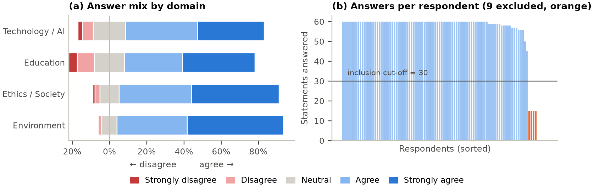
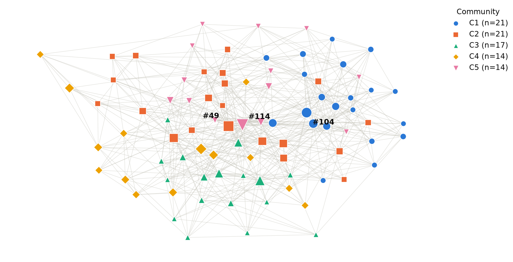
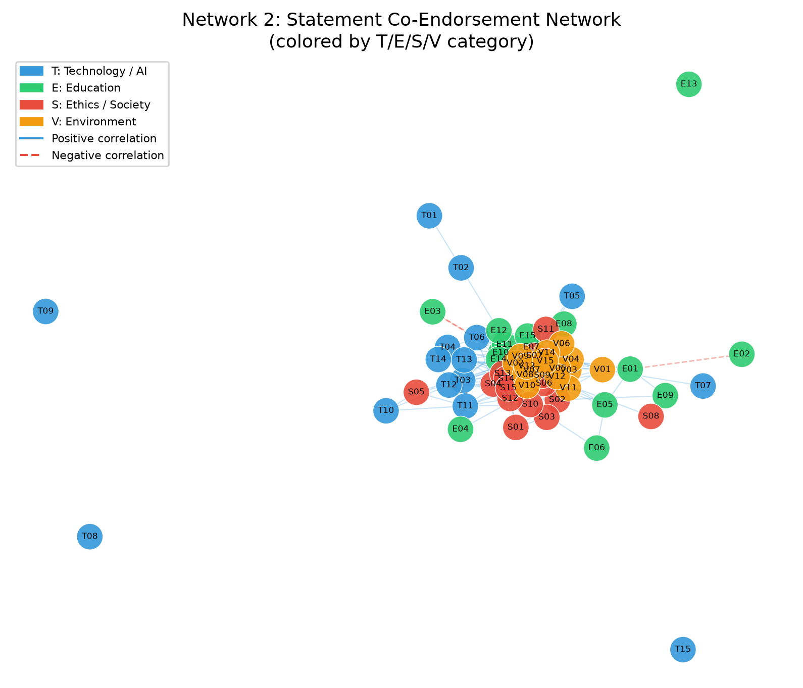
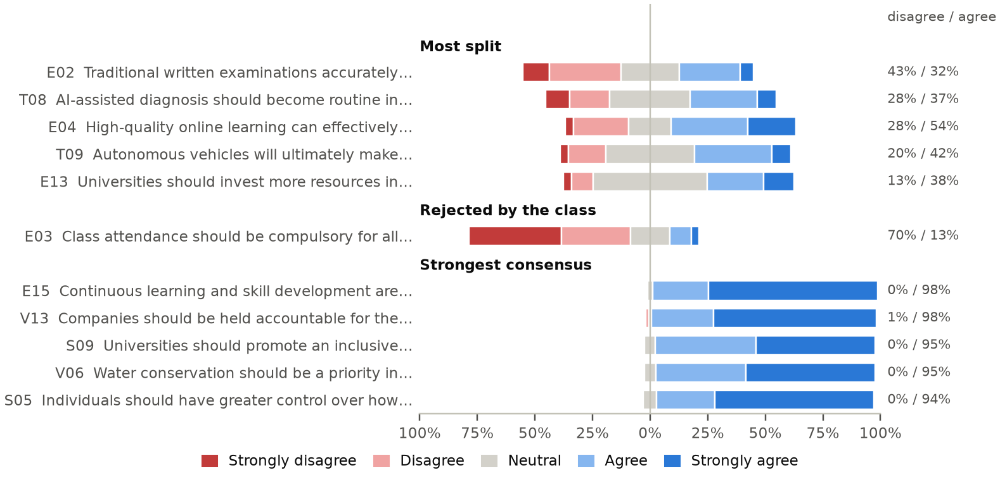
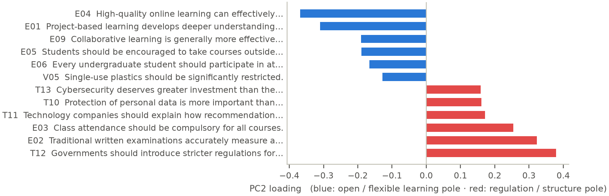
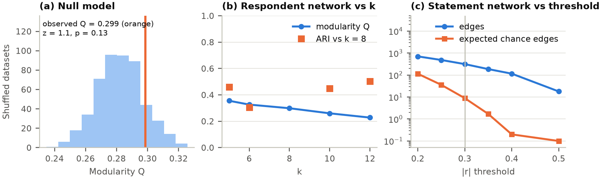

# Opinion Network Formation from Class Survey Responses

**Team Name:** Titan Mandal

**GitHub Repository:** [sarvesh2005takbhate/Titan_Mandal](https://github.com/sarvesh2005takbhate/Titan_Mandal)

---

## Summary

We model a 60-statement Likert survey (Technology, Education, Ethics, Environment) as two networks: a **respondent network** (who thinks alike) and a **statement network** (which opinions travel together). Key findings:

- **A consensus class.** 79% of all answers are Agree/Strongly Agree (Environment 87%, Ethics 85%); disagreement is concentrated in a handful of Education and Technology statements.
- **No distinct opinion camps.** Respondent communities (Q = 0.299) are not significantly stronger than in shuffled data (null Q = 0.282 ± 0.015, p = 0.13), change between runs, and the main opinion scores are unimodal. Opinions show diffuse structure rather than stable camps.
- **A leading axis of disagreement:** regulation and traditional structure (T12, E02, E03) versus open, flexible learning (E04, E01, E09). At the |r| ≥ 0.30 cut-off all 4 negative statement correlations involve Education and their bootstrap 95% intervals exclude zero; relaxing to the FDR boundary (|r| ≥ 0.27) admits 11 negative pairs, so opposition is Education-centred but not exclusive to it.
- **Domains matter, but themes cross them.** Within-domain links occur at 1.8× the proportion expected under a uniform-edge baseline, yet 57% of links cross domains and 3 of the 6 reproducible statement clusters mix domains (e.g. *Regulation & digital rights*).

## 1. Dataset Documentation

| Item | Value |
|---|---|
| Raw responses | 96 respondents × 60 statements (15 per domain: T, E, S, V) |
| Encoding | Strongly Disagree = −2, Disagree = −1, Neutral = 0, Agree = +1, Strongly Agree = +2 |
| Missing cells | 542 of 5760 (9.4%): 505 blank, 37 “No Comments” |
| Excluded respondents | 9 answered < 30 statements: 5 blank forms, 4 answered only the Technology block |
| Analysed | **87 respondents**, 62 missing cells (1.2%) |
| Answer mix (analysed) | 79% agree · 13% neutral · 7% disagree |

- **Missingness is dropout, not item refusal.** All 505 blank cells come from respondents who abandoned the form (4 stopped exactly after the Technology block, consistent with a form paged by domain). Only the 37 “No Comments” are interpreted as deliberate item-level skips. Both are kept as NaN, never as Neutral; similarities use only statements both respondents answered. 2 partially complete respondents with ≥ 30 answers are retained.
- **Strong agreement bias.** Mean answers are high in every domain, so raw similarity would mainly measure *how much* someone agrees. This motivates centring (Section 2).
- **Response-style flags (retained, reported).** 7 respondents gave the same answer to ≥ 75% of statements; #120 is a net dissenter (mean below zero); #119 answered mostly Neutral. These may be genuine views or low-effort answers.
- **Consistency check.** Near-duplicate statements in different domains correlate positively: T10–S05 r = 0.46; T02–E12 r = 0.53, suggesting answers are coherent.

## 2. Pipeline Followed

| | Network 1: Respondents | Network 2: Statements |
|---|---|---|
| Nodes | 87 respondents | 60 statements |
| Similarity | Row-centred cosine over shared statements (≥ 5) | Pearson r across respondents (pairwise complete) |
| Edges | k-nearest neighbours, k = 8 (positive similarity only) | abs(r) ≥ 0.30, signed (+ co-endorsement, − opposition) |
| Edge weight | similarity | abs(r) |
| Path distance | 1 / similarity | 1 / r, positive edges only |

1. **Clean.** Encode Likert answers, keep missing as NaN, and drop the 9 respondents with < 30 answers (otherwise they appear as isolated nodes and fake communities).
2. **Respondent similarity.** Subtract each respondent's mean answer, then take cosine similarity over shared statements. Centring also weakens the link between a node's degree and its agreement level (r = 0.66 → 0.42).
3. **Sparsify.** Link each respondent to its 8 most similar peers. Similarity stays the edge weight; shortest paths use distance = 1/similarity, so strong ties are short.
4. **Statement network.** Keep abs(r) ≥ 0.30 (p ≈ 0.005 at the median pairwise n = 86). Negative edges are kept for interpretation but excluded from path metrics and community detection, since opposition is not proximity.
5. **Test and analyse.** Every structural claim is checked against a baseline: shuffled answers (500×) for respondent communities and clustering, degree-preserving rewiring for the statement network, bootstrap resamples of respondents for edge confidence intervals and statement clusters, and parallel analysis for PCA. Descriptive tools: centrality, η², a split index for polarization, Cronbach's α.

### Design choices and why

Each choice was compared with the obvious alternative on this dataset. The last column gives the evidence.

| Decision | Chosen | Instead of | Why / benefit (evidence from this data) |
|---|---|---|---|
| Missing answers | NaN, pairwise-complete | Code as Neutral | A blank is not an opinion. Coding blanks as Neutral would raise the Neutral share from 13% to 21% and invent 505 answers. |
| Incomplete forms | Exclude < 30 answers | Impute | Imputing 45–60 of 60 answers fabricates a profile; kept as-is, the 5 blank forms become isolated nodes and fake communities. |
| Respondent similarity | Row-centred cosine | Raw cosine, Euclidean | Compares *which* statements a person favours, not how much they agree: mean similarity 0.68 → 0.26. Euclidean distance also grows with the number of shared answers. |
| Sparsification | k-NN, k = 8 | Global similarity threshold | A threshold with the same edge count leaves 15 respondents isolated (16 components); k-NN gives every respondent ≥ k neighbours and is connected from k = 2. k ≈ √n, mid-range of the tested 5–12. |
| Path cost | 1 / similarity | 1 − similarity, hops | Keeps strong ties short while penalising weak ties; betweenness ranks barely change with 1 − similarity (ρ = 0.93), so results do not hinge on it. |
| Communities | Louvain | Greedy, label propagation, Girvan–Newman | Fast, weighted modularity optimisation. Greedy modularity reaches similar Q (0.31, 5 groups) but a different split (ARI 0.44); the margin over Louvain is comparable to Louvain's own seed-to-seed variation (Q = 0.284–0.303 across 20 seeds), so Louvain — whose stability is characterized in Section 3.2 — is retained. Label propagation finds 1 community — consistent with weak structure. Girvan–Newman is O(m²n) with no natural stopping point. |
| Significance | Shuffled-answer null model | Raw Q, random-graph baseline | k-NN graphs are modular and clustered by construction (null Q = 0.28, clustering 0.25). Shuffling keeps every statement's answer distribution and the full pipeline, so it tests exactly whether *combinations* of opinions cluster. |
| Statement clusters | Bootstrap consensus cores | One Louvain run | Two single runs on bootstrap resamples agree only at ARI 0.10; keeping statements co-clustered in ≥ 60% of 200 resamples reports only reproducible groups. |
| Partition agreement | ARI | NMI | Chance-corrected: unrelated partitions of the same sizes give ARI ≈ 0.00 but NMI 0.06, which rewards chance overlap. |
| Statement association | Signed Pearson r | Spearman; abs(r) | Spearman agrees closely (r = 0.93 over all pairs). Keeping the sign separates opposition from co-endorsement; abs(r) would treat the 4 opposing pairs as allies when clustering. |
| Edge threshold | abs(r) ≥ 0.30 | FDR cut-off, 0.20, 0.40 | Slightly stricter than Benjamini–Hochberg FDR control at 5% (392 edges, abs(r) ≥ 0.27). Under a simple all-null approximation, roughly 9 threshold-exceeding pairs would be expected by chance at |r| ≥ 0.30; this is not an estimate of the actual false-discovery proportion. 0.40 isolates 12 statements. |
| Centrality | Betweenness (on distance) | Degree, eigenvector | In k-NN every degree ≥ k by construction; eigenvector centrality tracks agreement level more (r = 0.52) than betweenness does (r = 0.34). |
| Polarization | Split index | Variance | Variance ranks E03 #2 most polarizing although 70% reject it; the split index is high only when both camps are large and reads directly in %. |
| Community profile | η² per statement | Domain averages | Size-weighted 0–1 effect size, comparable across statements; domain averages smooth over heterogeneous items (Education α = 0.58). |
| Dimensions | PCA + parallel analysis | Eyeballing variance explained | Parallel analysis compares each component with shuffled data; it shows 5 components above noise, so no single axis can be over-claimed. |

**Reproducibility.** One command (`python notebooks/full_pipeline.py`) regenerates every number, table and figure from the raw CSV with fixed seeds. Unit tests check the similarity, η², split-index, FDR and filtering maths, and all results are exported to `results.json`.

## 3. Analysis and Visualizations

### 3.1 Network-level metrics

| Metric | Respondent network | Statement network (positive edges) |
|---|---:|---:|
| Nodes | 87 | 60 |
| Edges | 559 | 312 |
| Density | 0.149 | 0.176 |
| Average degree | 12.85 | 10.4 |
| Weighted clustering | 0.196 | 0.246 |
| Clustering (unweighted) vs baseline | 0.31 (shuffled 0.25) | 0.41 (rewired 0.36) |
| Connected components | 1 | 7 |
| Avg. shortest path (hops) | 2.06 | 2.1 |
| Diameter (hops) | 4 | 5 |
| Avg. path length (distance units) | 4.41 | 5.4 |

Paths are short in both networks (about 2 hops). Both have more triangles than their baselines: respondent clustering exceeds shuffled-data k-NN graphs by 4 standard deviations, and statement clustering exceeds degree-preserving rewired graphs. Local neighbourhoods of like-minded respondents are therefore real even though global communities are not (Section 3.2). The respondent network is a single component; in the statement network 6 statements have no positive link (Section 3.3).

### 3.2 Respondent communities

- Louvain finds **5 communities** (sizes 21, 21, 17, 14, 14), Q = 0.299.
- **Null model:** networks from shuffled answers give Q = 0.282 ± 0.015 (z = 1.1, p = 0.13). The observed structure is **not significantly stronger than chance**.
- **Stability:** agreement with the main partition is ARI = 0.47 across Louvain seeds and 0.41 ± 0.11 when 10% of respondents are removed.
- **Diffuse structure rather than stable camps:** respondents' PC2 scores (Section 3.5) are unimodal (bimodality coefficient 0.37; > 0.555 would suggest two camps). Neighbours share their position on this axis (assortativity 0.50) but not their overall agreement level (0.11). Communities show separation along this leading axis, although the opinion space remains multidimensional: they split along PC2 (η² = 0.38; C1 -1.41 vs C4 +1.79), only modestly more than cutting shuffled data would (η² = 0.31).
- **What differs between them:** membership explains most variance for T07, E04, S08, T09 (η² = 0.28–0.32). No community disagrees with the class overall; they differ in emphasis.
- **Centrality:** #114, #49, #104 lie on the most shortest paths (highest betweenness). This is a structural position between similar-minded neighbourhoods, not a measure of influence.

### 3.3 Statement network

- **Signs:** 312 positive and 4 negative edges. At the |r| ≥ 0.30 cut-off every negative edge involves an Education statement:

| Statement A | Statement B | r | 95% bootstrap CI |
|---|---|---:|---:|
| E03 (Class attendance should be compulsory for all…) | E10 (Universities should prioritize innovation and…) | -0.44 | [-0.59, -0.24] |
| T03 (Students should disclose the use of AI in…) | E04 (High-quality online learning can effectively…) | -0.32 | [-0.49, -0.13] |
| E01 (Project-based learning develops deeper…) | E02 (Traditional written examinations accurately…) | -0.31 | [-0.49, -0.12] |
| T06 (Most repetitive jobs will eventually be replaced…) | E03 (Class attendance should be compulsory for all…) | -0.30 | [-0.48, -0.07] |

- **Are they real?** All 4 survive FDR correction over all 1,770 statement pairs and every interval excludes zero; only E03–E10 also survives the much stricter Bonferroni correction.
- **Threshold context:** the “all involve Education” pattern is specific to the 0.30 cut-off: at the FDR boundary (|r| ≥ 0.27) there are 11 negative correlations, 10 involving Education (E03 alone carries 8), including the pure Technology pair T01–T12 (r = -0.28) — opposition is Education-centred but not exclusive.
- **Domains vs themes:** if links ignored domains, 76% would cross domains; only 57% do, so within-domain links occur at 1.8× the proportion expected under a uniform-edge baseline. Domains matter, but most links still cross them.
- **Clusters:** the positive network is more modular than degree-preserving rewired graphs (Q = 0.20 vs 0.16 ± 0.01, z = 4), but any single partition is unreliable (two Louvain runs on bootstrap resamples agree at ARI 0.10). We therefore report **robust cores**: connected components of the graph that links two statements whenever they cluster together in ≥ 60% of 200 bootstrap resamples. Because connectivity can chain through intermediate statements, an individual pair inside a core may fall below 60%; the last column reports each core's average, and a typical pair of statements clusters together in only 23%.

| Core | Theme | Statements | Avg. pair co-clustered |
|---|---|---|---:|
| 1 | AI-ready, industry-linked education | E10, E12, E14, E15, T01, T02, T04, T06 | 54% |
| 2 | Regulation & digital rights | S05, T10, T12, T14, V02 | 51% |
| 3 | Active, interdisciplinary learning | E01, E05, E09 | 63% |
| 4 | Evidence & civic participation | S08, S10, S12 | 55% |
| 5 | Sustainable habits & education | S13, V03, V12 | 54% |
| 6 | Resource conservation | V04, V06, V15 | 59% |

- 25 of 60 statements belong to a core; 3 of 6 cores mix domains; e.g. core 2 spans Technology / AI, Ethics / Society, Environment (S05, T10, T12, T14, V02).
- **Unconnected statements:** E13, T08, T09, T15 have no edge at the 0.30 cut-off; their strongest associations (E13–S02 +0.28, T08–V11 +0.26, T09–V05 +0.26, T15–S14 +0.27) sit just below it, so they are weakly integrated rather than truly unconnected. E13 (49% Neutral), T08 (35% Neutral), T09 (38% Neutral) are among the five most-Neutral statements, i.e. statements of weaker directional consensus with higher Neutral response shares. E02, E03 connect only through negative edges.
- **Bridges:** highest betweenness: S09 (Universities should promote an inclusive…), E10 (Universities should prioritize innovation…), S07 (Equal opportunities should be prioritized…). Divisive statements sit at the periphery (split index vs weighted degree r = -0.53).

### 3.4 Polarization and consensus

Variance mixes a split class with a lopsided one, so we rank polarization by the **split index = min(% agree, % disagree)**, which is high only when both camps are large.

| Group | Statement | Disagree | Neutral | Agree | Mean |
|---|---|---:|---:|---:|---:|
| Most split | E02 (Traditional written examinations accurately measure a…) | 43% | 25% | 32% | -0.16 |
| Most split | T08 (AI-assisted diagnosis should become routine in healthcare.) | 28% | 35% | 37% | +0.07 |
| Most split | E04 (High-quality online learning can effectively complement…) | 28% | 18% | 54% | +0.44 |
| Most split | T09 (Autonomous vehicles will ultimately make transportation…) | 20% | 38% | 42% | +0.27 |
| Most split | E13 (Universities should invest more resources in research than…) | 13% | 49% | 38% | +0.34 |
| Rejected | E03 (Class attendance should be compulsory for all courses.) | 70% | 17% | 13% | -0.94 |
| Consensus | E15 (Continuous learning and skill development are essential…) | 0% | 2% | 98% | +1.71 |
| Consensus | V13 (Companies should be held accountable for the environmental…) | 1% | 1% | 98% | +1.67 |
| Consensus | S09 (Universities should promote an inclusive environment where…) | 0% | 5% | 95% | +1.47 |
| Consensus | V06 (Water conservation should be a priority in households,…) | 0% | 5% | 95% | +1.51 |
| Consensus | S05 (Individuals should have greater control over how their…) | 0% | 6% | 94% | +1.63 |

- Only 4 statements have ≥ 20% on both sides; the most divisive is E02 (Traditional written examinations accurately measure a…) (32% agree vs 43% disagree).
- **E03 is a consensus, not a split:** 70% disagree. Ranking by variance alone would have mislabelled it as polarizing.

### 3.5 Domain structure and opinion dimensions

- **Domain scores correlate positively.** Strongest S–V (r = 0.70), weakest T–E (r = 0.29).
- **Reliability:** Cronbach's α = T 0.64, E 0.58, S 0.82, V 0.87. Technology / AI and Education fall below 0.70 — lower internal consistency and greater item heterogeneity — so a single domain average smooths over that heterogeneity.
- **PCA with parallel analysis:** 5 components exceed the 95th percentile of shuffled data. PC1 (17.2%) is general agreement (95% of loadings share a sign; r = 0.98 with mean answer). **PC2 (6.2%) is the largest substantive dimension:** T12 (Governments should introduce stricter…), E02 (Traditional written examinations…), E03 (Class attendance should be compulsory…) versus E04 (High-quality online learning can…), E01 (Project-based learning develops deeper…), E09 (Collaborative learning is generally…). It is only slightly larger than PC3 (5.8%), so disagreement is multi-dimensional; we interpret PC2 because its loadings give a coherent descriptive contrast that is also reflected in several statement-level associations — the significant negative edges T03–E04, E01–E02 join its opposite poles. PCA and the correlations draw on the same response matrix, so this is descriptive alignment rather than independent evidence.
- **Imputation note:** PCA needs complete rows, so the 62 residual missing cells (1.2%) are imputed with column means before decomposing; a complete-case PCA (n = 68) reproduces the same second axis (PC2 loading correlation r = 0.89), so this choice does not drive the result.

### 3.6 Robustness

- **k:** modularity falls steadily from 0.36 (k = 5) to 0.23 (k = 12); partitions at other k agree only moderately with k = 8 (ARI 0.30–0.50), consistent with weak communities.
- **Threshold:** edges drop from 709 at 0.20 to 18 at 0.50. As a simple all-null approximation, approximately 9 threshold-exceeding pairs would be expected by chance at |r| ≥ 0.30 (at 0.20, ~115); this is not an estimate of the actual false-discovery proportion. 0.30 keeps most statements non-isolated. Per-threshold p-values are computed at the median pairwise n = 86; pairwise sample sizes actually vary 81–87.
- **Similarity choice:** raw and centred cosine give different respondent partitions (ARI = 0.34), another sign that respondent communities depend on modelling choices.
- **Statement-level results hold:** negative edges have bootstrap intervals excluding zero, Spearman gives nearly the same correlations (r = 0.93), and the statement pairs that define each core in Section 3.3 meet the ≥ 60% co-assignment threshold, with average pairwise co-clustering reported separately in the core table.

## 4. Results and Discussion

1. **The class largely agrees.** 4 of the 5 strongest-consensus statements are about Ethics or Environment, which are also the most internally consistent domains (α ≥ 0.82).
2. **Disagreement has a leading axis, not a single one.** The largest substantive dimension contrasts regulation and traditional structure (stricter AI rules, exams, compulsory attendance) with open, flexible learning (online, project-based, collaborative). It is supported by the significant negative edges, but several comparably small dimensions also exceed noise.
3. **The network shows diffuse structure rather than stable camps.** Communities are no stronger than in shuffled data, are unstable, and PC2 scores are unimodal. Respondents are embedded among neighbours with similar views (assortativity 0.50), but these neighbourhoods blend into each other rather than forming blocs. Averages alone could not show this; the null model makes it explicit.
4. **Domains shape opinions but do not contain them.** Within-domain links occur at 1.8× the proportion expected under a uniform-edge baseline, yet most links cross domains and 3 of 6 reproducible clusters mix them (regulation and rights: S05, T10, T12, T14, V02).
5. **High-Neutral statements are weakly integrated.** The most-Neutral statements (E13, T08, T09) have no association strong enough to enter the network (strongest |r| = 0.26–0.28); they are statements of weaker directional consensus and higher Neutral response shares rather than two-sided splits.

**A dynamics lens (conceptual).** Our data are a single snapshot and cannot test dynamics; they can only suggest questions for opinion-dynamics models. The observed combination — neighbours aligned on the main opinion axis (assortativity 0.50) with global community structure indistinguishable from the shuffled baseline — is the kind of configuration that averaging-style models (e.g. DeGroot) are standard tools for exploring; whether repeated averaging would reinforce local alignment without consolidating global camps is a question for simulation, not for a snapshot. The E03-centred opposition on the PC2 axis is a candidate fault line that bounded-confidence or threshold models could investigate. This is framing for future work, not a prediction; no simulation is performed.

### Limitations

- Small class sample (n = 87); strong agreement bias compresses the usable scale.
- Likert data are ordinal; Pearson r and cosine treat them as interval (Spearman gives near-identical results).
- 1,770 pairwise tests: the actual false-discovery proportion of the reported edges is not estimated; only the strongest survive Bonferroni.
- Respondent communities and statement clusters outside the robust cores are not reproducible.
- η² for communities is optimistic (communities are built from the same answers); the shuffled baseline shows how much.
- Edges are associations, not causal or social ties; centrality is not real-world influence.

### Conclusion

The survey describes a broadly like-minded class whose disagreement is spread thinly over several dimensions, the largest contrasting structure and regulation with openness and flexibility, mostly through Education. Network analysis reveals robust cross-domain themes and negatively associated pairs of statements. Null models and bootstraps show where the network is informative (edges, local neighbourhoods, statement cores) and where it is not (respondent communities).

## 5. Individual Contributions

- **Hrishikesh:** Data preparation, Likert encoding, missing-data handling, respondent similarity construction.
- **Sarvesh:** Network construction, Louvain community detection, centrality analysis, robustness experiments.
- **Shourya:** Visualization, statement-level analysis, post-review revisions including threshold/FDR analysis, PCA sensitivity, robustness and null-model updates, refined statement/community interpretations, dynamics discussion, and final verification of the results and report.
