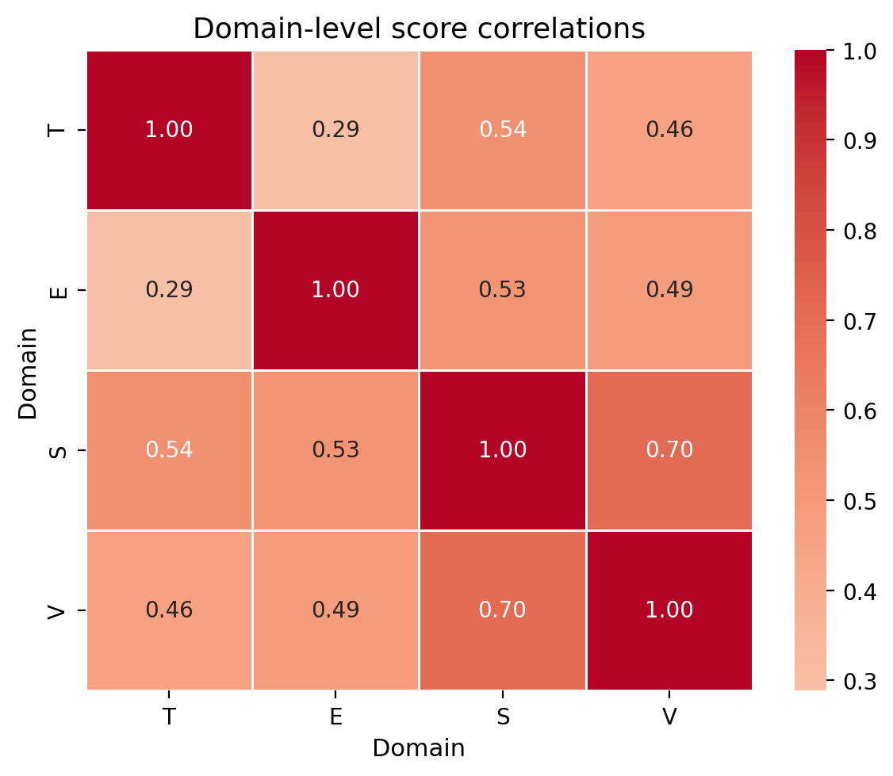
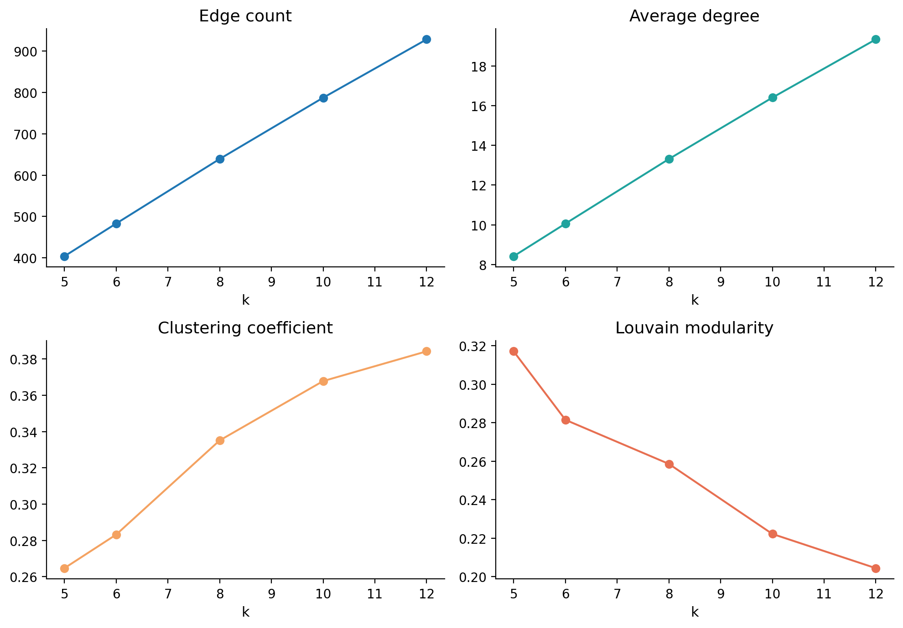
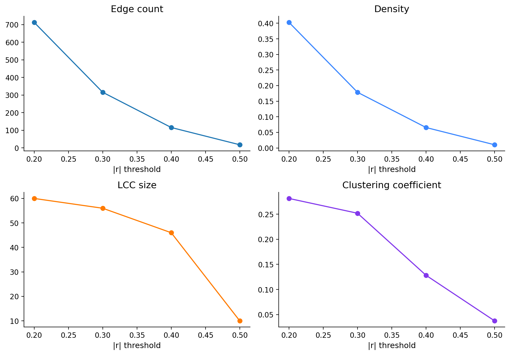

# Opinion Network Analysis of Class Survey Responses

**Course Assignment**: Data Processing & Complex Networks (DPCN)
**Team Name**: Titan Mandal
**GitHub Repository**: [sarvesh2005takbhate/Titan_Mandal](https://github.com/sarvesh2005takbhate/Titan_Mandal)

---

## 1. Executive Summary

This report analyzes a 96-respondent, 60-item Likert opinion network using two complementary graphs: a respondent similarity network and a statement association network. The data cover four domains: Technology / AI (T), Education (E), Ethics / Society (S), and Environment (V).

The respondent network uses cosine similarity over 60-item Likert opinion vectors and then applies k-NN sparsification. A key methodological correction was made to ensure that similarity is not confused with shortest-path distance: path lengths use a monotone distance transformation, while similarity weights remain available for interpretation. This preserves the intended meaning of stronger similarity as stronger affinity while allowing graph distances to reflect cost-based connectivity. The resulting networks suggest that consensus is strongest around environmental and ethical values, while education-related items remain the main source of polarization.

The statement network shows a strongly signed structure: most retained edges are positive, but negative correlations still identify substantively important tensions. The strongest community signal is not a single ideological split, but a patterned set of respondent communities that differ more in their educational attitudes than in their general environmental ethos.

## 2. Dataset Documentation

- Respondents: 96
- Statements: 60
- Total data cells: 5760
- Missing cells: 542 (9.41%)
- Missing responses are kept as NaN rather than coded as neutral values.
- Response encoding: Strongly Disagree = -2, Disagree = -1, Neutral = 0, Agree = +1, Strongly Agree = +2.

## 3. Network Construction

### 3.1 Respondent network

- Nodes = respondents (96)
- Edges = k-NN similarity network with k=8 in the main run; final edge count = 639.
- Similarity measure = pairwise-complete cosine similarity on the 60-item Likert vectors, using only statements answered by both respondents.
- Distance used for shortest paths = 1 / similarity for positive similarities; non-positive similarities are treated as non-connecting for path computations.

### 3.2 Statement network

- Nodes = statements (60)
- Edges = Pearson correlation with |r| >= 0.30; positive edges denote co-endorsement and negative edges denote opposition.
- Positive edges: 312; negative edges: 4.

## 4. Network-Level Analysis

| Metric | Respondent Network | Statement Network |
|---|---:|---:|
| Nodes | 96 | 60 |
| Edges | 639 | 316 |
| Density | 0.1401 | 0.1785 |
| Average degree | 13.31 | 10.53 |
| Clustering coefficient | 0.3351 | 0.252 |
| LCC size | 91 | 56 |
| Average shortest-path length | 2.7297 | 5.5439 |
| Diameter | 18.369517947544992 | 13.517960415060694 |

The corrected distance handling changes shortest-path calculations materially without altering the underlying similarity interpretation. That means weighted centrality and path-based comparisons now reflect valid network costs rather than an accidental misuse of similarity as distance.

## 5. Community Structure

- Louvain modularity: Q = 0.2586
- Number of communities: 12
- Community structure is strongest in educational attitudes, while environmental values remain comparatively uniform across communities.

## 6. Statement-Level Analysis

### Polarization and consensus

Most polarizing statement: E04 (1.365)
Most consensual statement: E15 (0.254)

| Rank | Code | Variance | Mean |
|---|---|---:|---:|
| 1 | E04 | 1.365 | 0.437 |
| 2 | E03 | 1.264 | -0.943 |
| 3 | E02 | 1.253 | -0.161 |
| 4 | T08 | 1.196 | 0.078 |
| 5 | S02 | 1.113 | 0.839 |

### Consensus table

| Rank | Code | Statement text | Mean | Variance |
|---|---|---|---:|---:|
| 1 | E15 | Continuous learning and skill development are essential throughout one's career. | 1.713 | 0.254 |
| 2 | V13 | Companies should be held accountable for the environmental impacts of their activities. | 1.671 | 0.319 |
| 3 | S09 | Stronger public trust in institutions is necessary for social progress. | 1.471 | 0.347 |
| 4 | V06 | Environmental sustainability should be integrated into higher education curricula. | 1.512 | 0.349 |
| 5 | S05 | Every individual has a responsibility to contribute positively to society. | 1.632 | 0.352 |

## 7. Signed Statement Network

- Positive edges: 312 (98.73%)
- Negative edges: 4 (1.27%)
- The signed network reveals that association is not purely cooperative; negative correlation edges are meaningful and identify the strongest conceptual tensions.

## 8. Domain-Level Analysis

- Strongest cross-domain association: S-V (r = 0.7045)
- Weakest cross-domain association: T-E (r = 0.2886)
- The domain-level score correlations are reported in the generated heatmap and show that environmental and ethical values remain more coherent than education-related opinions, while the weakest cross-domain relationship is between technology and education.

## 9. Robustness and Sensitivity

- Respondent network k-sensitivity: [{'k': 5, 'edges': 404, 'density': 0.0886, 'avg_degree': 8.42, 'clustering': 0.2647, 'components': 6, 'lcc_nodes': 91, 'modularity': 0.3171, 'n_communities': 12}, {'k': 6, 'edges': 483, 'density': 0.1059, 'avg_degree': 10.06, 'clustering': 0.2832, 'components': 6, 'lcc_nodes': 91, 'modularity': 0.2815, 'n_communities': 12}, {'k': 8, 'edges': 639, 'density': 0.1401, 'avg_degree': 13.31, 'clustering': 0.3351, 'components': 6, 'lcc_nodes': 91, 'modularity': 0.2586, 'n_communities': 12}, {'k': 10, 'edges': 787, 'density': 0.1726, 'avg_degree': 16.4, 'clustering': 0.3678, 'components': 6, 'lcc_nodes': 91, 'modularity': 0.2222, 'n_communities': 10}, {'k': 12, 'edges': 928, 'density': 0.2035, 'avg_degree': 19.33, 'clustering': 0.3842, 'components': 6, 'lcc_nodes': 91, 'modularity': 0.2044, 'n_communities': 10}]
- Statement network threshold sensitivity: [{'threshold': 0.2, 'edges': 713, 'density': 0.4028, 'positive_edges': 689, 'negative_edges': 24, 'lcc_size': 60, 'clustering': 0.2815, 'components': 1}, {'threshold': 0.3, 'edges': 316, 'density': 0.1785, 'positive_edges': 312, 'negative_edges': 4, 'lcc_size': 56, 'clustering': 0.252, 'components': 5}, {'threshold': 0.4, 'edges': 116, 'density': 0.0655, 'positive_edges': 115, 'negative_edges': 1, 'lcc_size': 46, 'clustering': 0.1282, 'components': 14}, {'threshold': 0.5, 'edges': 18, 'density': 0.0102, 'positive_edges': 18, 'negative_edges': 0, 'lcc_size': 10, 'clustering': 0.0374, 'components': 44}]
- Community stability (NMI): 0.733
- Cosine vs Pearson respondent similarity correlation: 0.6495

## 10. Results and Discussion

The network suggests that the class is broadly aligned on environmental accountability and inclusive ethics but materially less aligned on how education should operate. The strongest structural polarization is not due to drastic disagreement across all domains, but to a relatively narrow set of educational items such as attendance requirements, exams, and digital learning.

This illustrates the key central question of the assignment: ordinary survey means would miss the relational structure. The network shows that some respondents are structurally central because they occupy bridging positions within the network, while others are locally cohesive yet less centrally positioned. Centrality here indicates structural position and does not establish real-world influence or authority.

## 11. Limitations

- Likert responses are ordinal rather than truly continuous observations.
- Cosine similarity measures pattern orientation, not literal agreement on all statements.
- Pearson correlation assumes a linear form of association.
- Missing data and k-NN sparsification are modeling choices that alter network topology.
- Community detection is algorithm-dependent and can vary with seed and resolution.
- Network edges are associative, not causal.
- Centrality does not measure real-world influence directly.

## 12. Conclusion

The network analysis suggests that the class is not uniformly polarized. Instead, the strongest structure is a combination of broad consensus on ethical and environmental issues and a more heterogeneous set of educational arguments. This demonstrates how network methods can recover relational patterns that are not visible in raw averages alone.

## 13. Individual Contributions

- Hrishikesh: Data preparation, Likert encoding, missing-data handling, respondent similarity construction.
- Sarvesh: Network construction, Louvain community detection, centrality analysis, robustness experiments.
- Shourya: Visualization, statement-level analysis, report compilation and PDF generation.

---

