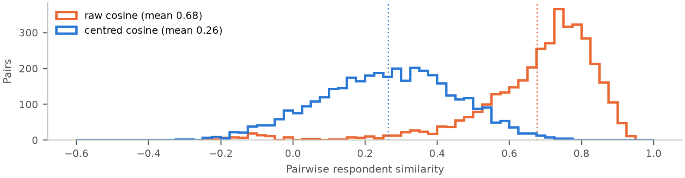
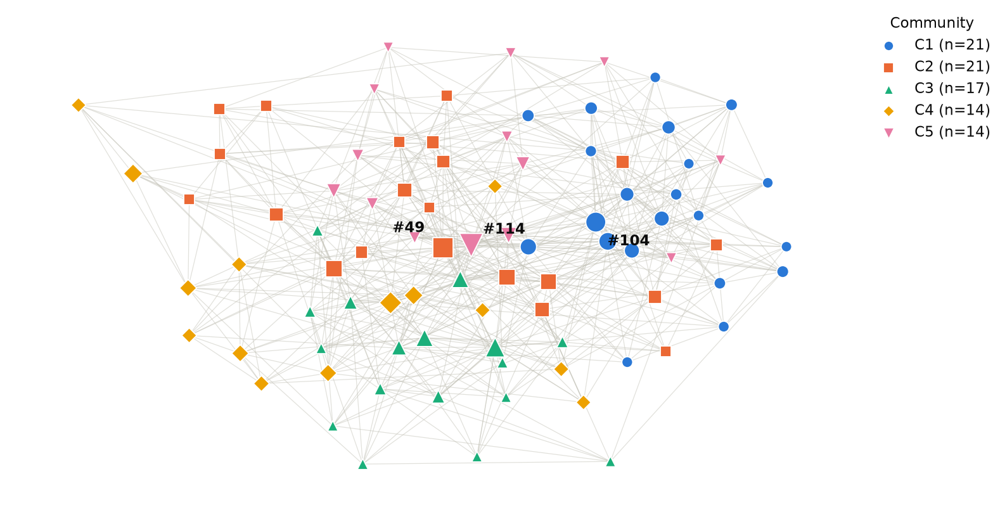
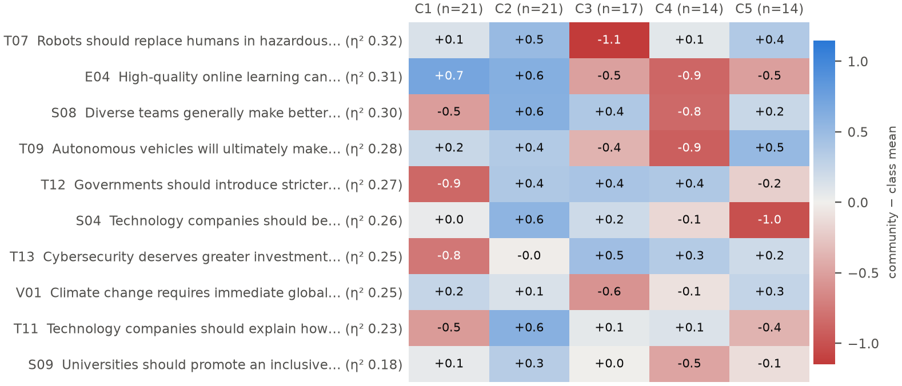
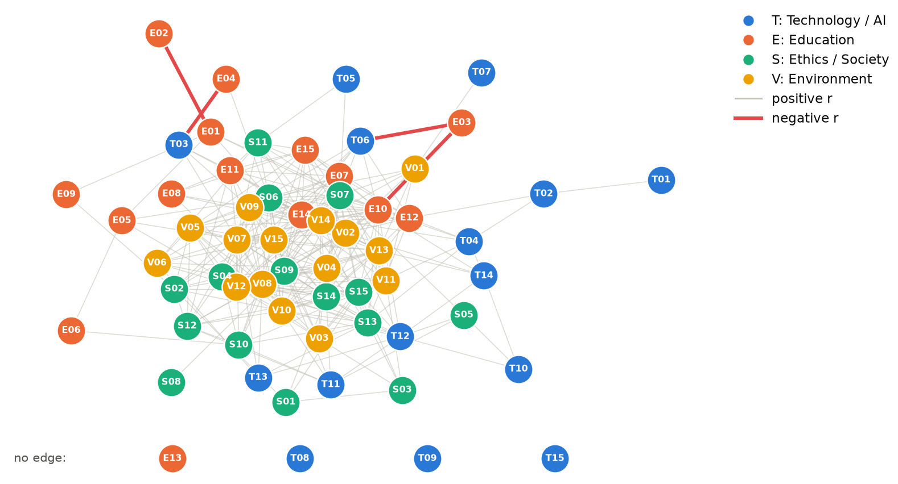
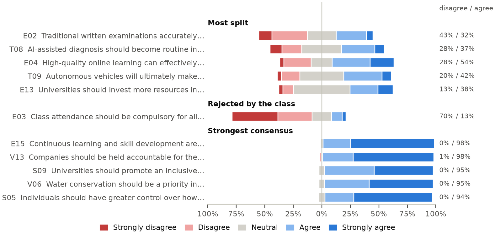
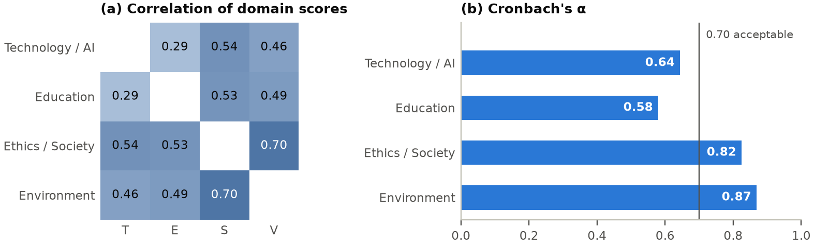
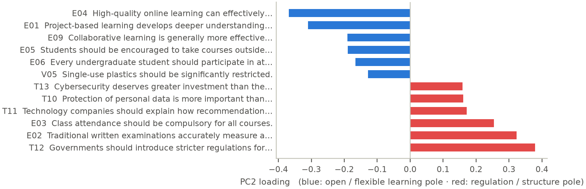

# Opinion Network Formation from Class Survey Responses

**Team Name:** Titan Mandal

**GitHub Repository:** [sarvesh2005takbhate/Titan_Mandal](https://github.com/sarvesh2005takbhate/Titan_Mandal)

---

## Summary

We model a 60-statement Likert survey (Technology, Education, Ethics, Environment) as two networks: a **respondent network** (who thinks alike) and a **statement network** (which opinions travel together). Key findings:

- **A consensus class.** 79% of all answers are Agree/Strongly Agree. Environment and Ethics are near-unanimous; disagreement is concentrated in a handful of Education and Technology statements.
- **No distinct opinion camps.** Respondent communities (Q = 0.299) are only marginally stronger than in shuffled data (null Q = 0.284 ± 0.016, p = 0.22) and change between runs (ARI ≈ 0.41). Opinions vary along a continuum, not in blocs.
- **The clearest axis of disagreement:** support for regulation and traditional structure (T12, E02, E03) versus open, flexible learning (E04, E01, E09). All 4 negative statement correlations involve Education.
- **Themes cut across domains.** 57% of statement edges link different domains; the statement network forms 4 cross-domain clusters, including a *digital rights & AI regulation* cluster.

## 1. Dataset Documentation

| Item | Value |
|---|---|
| Raw responses | 96 respondents × 60 statements (15 per domain: T, E, S, V) |
| Encoding | Strongly Disagree = −2, Disagree = −1, Neutral = 0, Agree = +1, Strongly Agree = +2 |
| Missing cells | 542 of 5760 (9.4%): 505 blank, 37 “No Comments” |
| Excluded respondents | 9 answered < 30 statements: 5 blank forms, 4 stopped after the Technology page |
| Analysed | **87 respondents**, 62 missing cells (1.2%) |
| Answer mix (analysed) | 79% agree · 13% neutral · 7% disagree |

- **Missingness is dropout, not item refusal.** All 505 blank cells come from respondents who abandoned the form (4 stopped exactly after the Technology block, consistent with a form paged by domain). Only the 37 “No Comments” are deliberate skips. Both are kept as NaN, never as Neutral; similarities use only statements both respondents answered. 2 partially complete respondents with ≥ 30 answers are retained.
- **Strong agreement bias.** Mean answers are high in every domain, so raw similarity would mainly measure *how much* someone agrees. This motivates centring (Section 2).
- **Response-style flags (retained, reported).** 7 respondents gave the same answer to ≥ 75% of statements; #120 is a net dissenter (mean below zero); #119 answered mostly Neutral. These may be genuine views or low-effort answers.
- **Consistency check.** Near-duplicate statements in different domains correlate positively: T10–S05 r = 0.46; T02–E12 r = 0.53, suggesting answers are coherent.

## 2. Pipeline Followed

| | Network 1: Respondents | Network 2: Statements |
|---|---|---|
| Nodes | 87 respondents | 60 statements |
| Similarity | Row-centred cosine over shared statements (≥ 5) | Pearson r across respondents (pairwise complete) |
| Edges | k-nearest neighbours, k = 8 (positive similarity only) | abs(r) ≥ 0.30, signed (+ co-endorsement, − opposition) |
| Edge weight | similarity | abs(r) |
| Path distance | 1 / similarity | 1 / r, positive edges only |

1. **Clean.** Encode Likert answers, keep missing as NaN, and drop the 9 respondents with < 30 answers (otherwise they appear as isolated nodes and fake communities).
2. **Respondent similarity.** Subtract each respondent's mean answer, then take cosine similarity over shared statements. Centring also weakens the link between a node's degree and its agreement level (r = 0.66 → 0.42; Figure 2).
3. **Sparsify.** Link each respondent to its 8 most similar peers. Similarity stays the edge weight; shortest paths use distance = 1/similarity, so strong ties are short.
4. **Statement network.** Keep abs(r) ≥ 0.30 (p ≈ 0.005 at n = 87). Negative edges are kept for interpretation but excluded from path metrics and community detection, since opposition is not proximity.
5. **Analyse.** Louvain communities tested against 50 shuffled datasets and for stability; centrality; η² (variance explained by community); a split index for polarization; PCA and Cronbach's α for domain structure; sensitivity to k and threshold.

### Design choices and why

Each choice was compared with the obvious alternative on this dataset. The last column gives the evidence.

| Decision | Chosen | Instead of | Why / benefit (evidence from this data) |
|---|---|---|---|
| Missing answers | NaN, pairwise-complete | Code as Neutral | A blank is not an opinion. Coding blanks as Neutral would raise the Neutral share from 13% to 21% and invent 505 answers. |
| Incomplete forms | Exclude < 30 answers | Impute | Imputing 45–60 of 60 answers fabricates a profile; kept as-is, the 5 blank forms become isolated nodes and fake communities. |
| Respondent similarity | Row-centred cosine | Raw cosine, Euclidean | Compares *which* statements a person favours, not how much they agree: mean similarity 0.68 → 0.26. Euclidean distance also grows with the number of shared answers. |
| Sparsification | k-NN, k = 8 | Global similarity threshold | A threshold with the same edge count leaves 15 respondents isolated (16 components); k-NN gives every respondent ≥ k neighbours and is connected from k = 2. k ≈ √n, mid-range of the tested 5–12. |
| Path cost | 1 / similarity | 1 − similarity, hops | Keeps strong ties short while penalising weak ties; betweenness ranks barely change with 1 − similarity (ρ = 0.93), so results do not hinge on it. |
| Communities | Louvain | Greedy, label propagation, Girvan–Newman | Fast, weighted modularity optimisation. Greedy modularity reaches similar Q (0.31, 5 groups) but a different split (ARI 0.44); label propagation finds 1 community — consistent with weak structure. Girvan–Newman is O(m²n) with no natural stopping point. |
| Significance | Shuffled-answer null model | Raw Q, configuration model | k-NN graphs are modular by construction (null Q = 0.28). Shuffling keeps every statement's answer distribution and the full pipeline, so it tests exactly whether *combinations* of opinions cluster. |
| Partition agreement | ARI | NMI | Chance-corrected: unrelated partitions of the same sizes give ARI ≈ 0.00 but NMI 0.06, which rewards chance overlap. |
| Statement association | Signed Pearson r | Spearman; abs(r) | Spearman agrees closely (r = 0.93 over all pairs). Keeping the sign separates opposition from co-endorsement; abs(r) would have merged the 4 Education tensions into clusters. |
| Edge threshold | abs(r) ≥ 0.30 | 0.20 or 0.40 | ~9 chance edges (3%) vs ~115 at 0.20; 0.40 isolates 12 statements. |
| Centrality | Betweenness (on distance) | Degree, eigenvector | In k-NN every degree ≥ k by construction; eigenvector centrality tracks agreement level more (r = 0.52) than betweenness does (r = 0.34). Betweenness captures bridging. |
| Polarization | Split index | Variance | Variance ranks E03 #2 most polarizing although 70% reject it; the split index is high only when both camps are large and reads directly in %. |
| Community profile | η² per statement | Domain averages | Size-weighted 0–1 effect size, comparable across statements; domain averages mix opposing statements (Education α = 0.58). |
| Domain validity | Cronbach's α, PCA | Assume domains coherent | Tests whether a domain average is meaningful; PCA separates general agreement (PC1) from substantive disagreement (PC2). |

**Reproducibility.** One command (`python notebooks/full_pipeline.py`) regenerates every number, table and figure from the raw CSV with fixed seeds. Unit tests check the similarity, η², split-index and filtering maths, and all results are exported to `results.json`.

## 3. Analysis and Visualizations

### 3.1 Network-level metrics

| Metric | Respondent network | Statement network (positive edges) |
|---|---:|---:|
| Nodes | 87 | 60 |
| Edges | 559 | 312 |
| Density | 0.149 | 0.176 |
| Average degree | 12.85 | 10.4 |
| Weighted clustering | 0.196 | 0.246 |
| Clustering ÷ random-graph expectation | 2.07 | 2.3 |
| Connected components | 1 | 7 |
| Largest component | 87 | 54 |
| Avg. shortest path (hops) | 2.06 | 2.1 |
| Diameter (hops) | 4 | 5 |
| Avg. path length (distance units) | 4.41 | 5.4 |

Paths are short in both networks (about 2 hops). Clustering is 2.1× (respondents) and 2.3× (statements) what a random graph of the same density would give, so similar opinions form local triangles rather than random links. After cleaning, the respondent network is a single component. In the statement network 6 statements have no positive link; see Section 3.3.

### 3.2 Respondent communities

- Louvain finds **5 communities** (sizes 21, 21, 17, 14, 14), Q = 0.299.
- **Null model:** networks from shuffled answers give Q = 0.284 ± 0.016 (z = 0.9, p = 0.22). The observed structure is **not significantly stronger than chance**, because k-NN graphs are modular by construction.
- **Stability:** agreement with the main partition is ARI = 0.47 across Louvain seeds and 0.41 ± 0.11 when 10% of respondents are removed. Communities are soft groupings.
- **What differs between them:** community membership explains most variance for T07, E04, S08, T09 (η² = 0.28–0.32; mean η² by domain: T 0.16, E 0.11, S 0.12, V 0.11). No community disagrees with the class overall; they differ in emphasis.
- The groups line up with the opinion axis of Section 3.5: community C1 leans towards open learning (mean PC2 score -1.41) and C4 towards regulation and structure (+1.79); community explains η² = 0.38 of that axis.
- **Centrality:** the most central respondents by betweenness are #114, #49, #104. Their positions are structural (bridging similar-minded groups), not a measure of influence.

### 3.3 Statement network

- **Signs:** 312 positive and 4 negative edges. Every negative edge involves an Education statement:

| Statement A | Statement B | r |
|---|---|---:|
| E03 (Class attendance should be compulsory for all courses.) | E10 (Universities should prioritize innovation and problem-…) | -0.44 |
| T03 (Students should disclose the use of AI in assignments…) | E04 (High-quality online learning can effectively…) | -0.32 |
| E01 (Project-based learning develops deeper understanding…) | E02 (Traditional written examinations accurately measure a…) | -0.31 |
| T06 (Most repetitive jobs will eventually be replaced by…) | E03 (Class attendance should be compulsory for all courses.) | -0.30 |

- **Cross-domain themes:** 57% of edges connect different domains. Louvain on positive edges gives 4 clusters (Q = 0.21), much more modular than the domain labels themselves (Q = 0.13; ARI with domains = 0.14):

| Cluster | Theme | Statements |
|---|---|---|
| 1 | Environmental & social responsibility | S01, S03, S07, S08, S09, S13, S14, S15, T05, T07, V01, V02, V03, V04, V10, V11, V12, V13 |
| 2 | AI-ready, industry-linked education | E07, E08, E10, E11, E12, E14, E15, S11, T01, T02, T03, T04, T06, V09, V14 |
| 3 | Active learning & civic action | E01, E04, E05, E06, E09, S02, S04, S06, S10, S12, V05, V06, V07, V08, V15 |
| 4 | Digital rights & AI regulation | S05, T10, T11, T12, T13, T14 |

- **Unconnected statements:** E13, T08, T09, T15 have no edge at all. E13 (49% Neutral), T08 (35% Neutral), T09 (38% Neutral) are among the five most-Neutral statements in the survey: uncertainty, not conviction, dominates them. E02, E03 connect only through negative edges.
- **Bridges:** highest betweenness: S09 (Universities should promote an inclusive…), E10 (Universities should prioritize innovation…), S07 (Equal opportunities should be prioritized…). Divisive statements sit at the periphery (split index vs weighted degree r = -0.53).

### 3.4 Polarization and consensus

Variance mixes a split class with a lopsided one, so we rank polarization by the **split index = min(% agree, % disagree)**, which is high only when both camps are large.

| Group | Statement | Disagree | Neutral | Agree | Mean |
|---|---|---:|---:|---:|---:|
| Most split | E02 (Traditional written examinations accurately measure a…) | 43% | 25% | 32% | -0.16 |
| Most split | T08 (AI-assisted diagnosis should become routine in healthcare.) | 28% | 35% | 37% | +0.07 |
| Most split | E04 (High-quality online learning can effectively complement…) | 28% | 18% | 54% | +0.44 |
| Most split | T09 (Autonomous vehicles will ultimately make transportation…) | 20% | 38% | 42% | +0.27 |
| Most split | E13 (Universities should invest more resources in research than…) | 13% | 49% | 38% | +0.34 |
| Rejected | E03 (Class attendance should be compulsory for all courses.) | 70% | 17% | 13% | -0.94 |
| Consensus | E15 (Continuous learning and skill development are essential…) | 0% | 2% | 98% | +1.71 |
| Consensus | V13 (Companies should be held accountable for the environmental…) | 1% | 1% | 98% | +1.67 |
| Consensus | S09 (Universities should promote an inclusive environment where…) | 0% | 5% | 95% | +1.47 |
| Consensus | V06 (Water conservation should be a priority in households,…) | 0% | 5% | 95% | +1.51 |
| Consensus | S05 (Individuals should have greater control over how their…) | 0% | 6% | 94% | +1.63 |

- Only 3 statements have ≥ 20% on both sides; the most divisive is E02 (Traditional written examinations accurately measure a…) (32% agree vs 43% disagree).
- **E03 is a consensus, not a split:** 70% reject compulsory attendance. High variance alone would have mislabelled it as polarizing.

### 3.5 Domain structure and the clearest opinion axis

- **Domain scores correlate positively.** Strongest S–V (r = 0.70), weakest T–E (r = 0.29).
- **Reliability:** Cronbach's α = T 0.64, E 0.58, S 0.82, V 0.87. Technology / AI and Education fall below 0.70: they mix opposing positions (e.g. exams and attendance vs project-based and online learning), so a single domain average hides the real disagreement.
- **PCA:** PC1 (17.2% of variance) is general agreement (95% of loadings share a sign; r = 0.98 with mean answer). **PC2 (6.2%) is the clearest substantive axis:** T12 (Governments should introduce stricter…), E02 (Traditional written examinations…), E03 (Class attendance should be compulsory…) versus E04 (High-quality online learning can…), E01 (Project-based learning develops deeper…), E09 (Collaborative learning is generally…). It is only slightly larger than PC3 (5.8%), so beyond general agreement opinions are weakly structured; PC2 stands out because it matches the negative edges and the community differences.

### 3.6 Robustness

- **k:** modularity falls steadily from 0.36 (k = 5) to 0.23 (k = 12); partitions at other k agree only moderately with k = 8 (ARI 0.30–0.50), consistent with weak communities.
- **Threshold:** edges drop from 709 at 0.20 (~115 expected chance edges) to 18 at 0.50. 0.30 keeps the network largely connected while limiting chance edges to ~3%.
- **Similarity choice:** raw and centred cosine give different partitions (ARI = 0.34), another sign that respondent communities depend on modelling choices, whereas the statement-level findings are stable.

## 4. Results and Discussion

1. **The class largely agrees.** Environmental and ethical statements (accountability, sustainability, inclusion) have the strongest consensus and the most internally consistent domains (α ≥ 0.82).
2. **Disagreement follows one recognisable axis.** Beneath the shared optimism, the main difference is attitude to control: regulating AI and protecting data, exams and compulsory attendance, versus online, project-based and collaborative learning. Education holds all 4 opposing edges and the most split statements.
3. **The network shows a continuum, not camps.** Communities are no stronger than in shuffled data and are unstable. Respondents differ by degree along the axis above, not by belonging to opposing groups. Averages alone could not show this; the null model makes it explicit.
4. **Opinions organise by theme, not survey section.** Most statement links cross domains, e.g. data privacy and AI regulation form one cluster (S05, T10, T11, T12, T13, T14). The four-domain survey layout does not match how respondents actually group issues.
5. **Uncertain topics stay disconnected.** Statements with many Neutral answers (AI diagnosis, autonomous vehicles, research vs infrastructure spending) do not correlate with anything, suggesting unformed rather than divided opinions.

### Limitations

- Small, self-selected class sample (n = 87); strong agreement bias compresses the usable scale.
- Likert data are ordinal; Pearson r and cosine treat them as interval.
- k, threshold and similarity choices shape the respondent network; communities in particular are not robust.
- η² for communities is descriptive: communities are built from the same answers, so it is optimistic.
- Beyond general agreement the data are weakly structured (PC2 6.2% vs PC3 5.8% of variance).
- Edges are associations, not causal or social ties; centrality is not real-world influence.

### Conclusion

The survey describes a broadly like-minded class whose meaningful disagreement is concentrated along one axis: structure and regulation versus openness and flexibility, expressed mostly through Education. Network analysis reveals this cross-domain structure. Significance and robustness checks show where the network is informative (statement associations) and where it is not (respondent communities).

## 5. Individual Contributions

- **Hrishikesh:** Data preparation, Likert encoding, missing-data handling, respondent similarity construction.
- **Sarvesh:** Network construction, Louvain community detection, centrality analysis, robustness experiments.
- **Shourya:** Visualization, statement-level analysis, report compilation and PDF generation.
